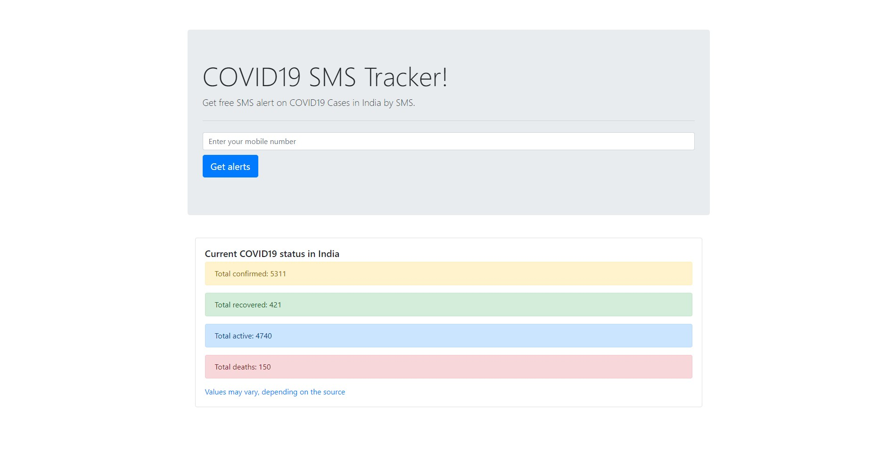

# Corona-SMS-Tracker

Get free SMS alert on COVID19 Cases in India by SMS.

1. Clone project on local machine
   ```
   git clone https://github.com/pprathameshmore/Corona-SMS-Tracker.git
   ```
2. Install Node modules
    ```
    npm install
    ```
3. Replace Twilio Account_ID and API_KEY with your
   
4. Now run application
    ```
    node bin/www
    ```

